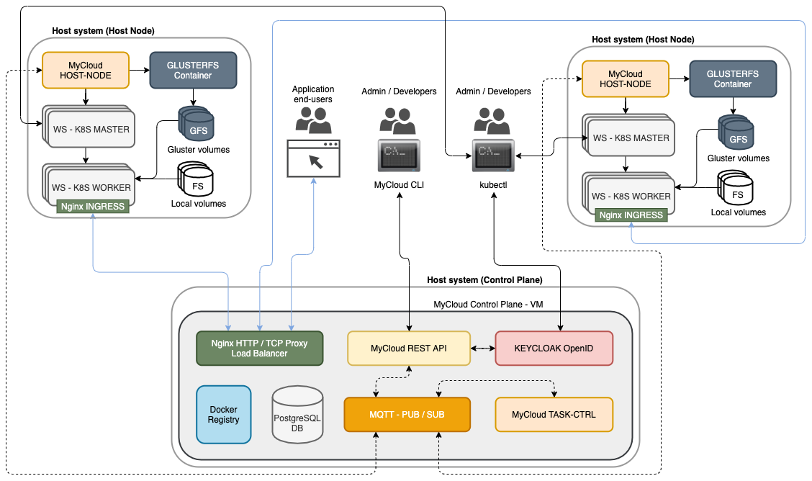

# MyCloud-PaaS - A private cloud PaaS platform

## About

MyCloud-PaaS is a open source, multi-tenant cloud platform that can be installed on any Intel/AMD 64 bit based hardware components. It is based on Kubernetes at it's core, providing organizations and teams with isolated clusters and a collection of managed services to be deployed. Some of MyCloud's features are:

- From the ground up multi-tenant private cloud PaaS solution (Accounts => Organizations => Workspaces (1 workspace = 1 dedicated K8S cluster))
- Provision managed core services such as various databases, messaging brokers and other services for each tenant
- Easily scale your tenant cluster for HA use cases
- Manage your images with a private docker registry
- Manage storage and volumes independantly for each tenant
- Provides a distributed storage solution based on GlusterFS
- Self service using CLI command line

## Motivations

One could ask why go through the hassle of building such a complex solution if one could simply create an account on AWS, Microsoft, GCP or any other cloud provider out there?  
In my current company which I will not name here, it was decided to build a private cloud platform (IaaS & PaaS) that is 100% hosted on the company intranet, completely disconnected from the internet and from the ground up. This is mainly because of the very high demand in safeguarding company data. This lead to a developement effort a couple of years ago to build such a platform, effort that I am not part of, but that I am patiently waiting for in order to conduct our private day to day cloud business. It turnes out that building such a platform is far more complex that anticipated, which got me wondering why that is.  
Out of curiosity, I decided to play arrount with the idea of building a private PaaS cloud myself during my spare time, initially just for learning purposes to try and understand what is involved here. One thing lead to another and I realized that I have reached a point in my learning endavour that could actually have value to companies that need to undergo the same type of effort for the same reasons mentioned above.  
  
This is why today I am opening up this work to the opensource community, or as a source of insiration, or as a base to build their own private PaaS platform. Let's not forget that I am alone building this at the moment, and the amount of work required to pull this off is huge! The code base is still very fragile in terms of stability, there are currently no tests written (remember, this started as a learning experience, tests were not my priority given the time at my disposal), and there are still alot of features that need to be implemented. That said, I think there is currently enougth here to bring this to you guys as a preview. At some point, it would be great if other people could join the project, and contribute to it's developement to get things to move forward quicker. If you are interested, please drop me an email (mdundek@gmail.com).

## Install

The overall architecture of the solution looks like the following:



> The above diagram is an example setup. For testing purposes, you can install the "Control Plane" and one "Host Node" on a single machine. 
> For a production environement, you should deploy the "Controller Plane" on a dedicated machine, and a minimum of 2 "Host Nodes", each on it's own machine.
>
> I tested MyCloud on Ubuntu 18.04, as well as CentOS / RedHat 7 & 8.
> At the moment, most dependencies are downloaded directly from the internet. In the future, all dependencies will be packaged with the repo in order to simplify a offline installation scenario in case your target network has no internet access for security reasons. 

### Install the Control-Plane

To keep things easy for now, we deploy the control-plane on a VirtualBox VM. I chose to use Vagrant to orchestrate the deployment, because of it's convenience in terms of configuring and starting of new VMs as well as for it's ease of use in terms of provisionning software.

> PLEASE NOTE: Since we are using VirtualBox to run the control plane, it is possible to run the control plane on any operating system that supports VirtualBox.
> The installer will install the Git client, VirtualBox as well as Vagrant on your machine if not already present. It will then download the repo and performe some local configurations.
> For the time being, the script works only on Ubuntu >= 18.04, CentOS and RedHat 7 & 8. If you wish to install the control-plane on a different OS, you will have to install those 3 components manually, clone the repo, configure your Vagrantfile based on the provided template inside the folder `ìnstall/control-plane` and call the command `vagrant up`.

To install the control plane, run the following command in your terminal:

```
bash <(curl https://raw.githubusercontent.com/mdundek/mycloud/master/install/control-plane/install.sh)
```

The script will ask for some base configuration values. Provide a static IP for the controller plane VM on the target network that MyCloud will be running on, user credentials to set up and VM sizing parameters.

> NOTE: It is currently not possible to deploy the various MyCloud components on separate networks. The controll-plane and the host-nodes all have to be deployed on the same network (xxx.xxx.xxx.2-249). This gives you enougth addresses for over ~200 K8S Cluster VMs in total for all your tenants, given that your network can handle the traffic of course.

### Install the Host-node

The Host Node component is responsible for Virtualbox based K8S Cluster management tasks as well as Volume provisionning tasks such as local volumes as well as Gluster volumes.  
You can chose to deploy a Host Node component to handle only Gluster Volume management tasks, Kubernetes Cluster management tasks or both. This can be usefull if you wish to dedicate certain host machines to distributed Gluster storage management only, and let other host machines deal with Virtualbox and K8S Cluster specific tasks.  

The Host Node controllers will also take care of scaling up or down your Kubernetes clusters, and deal with the setup of volumes, configure access to the docker registry, provision services on your cluster and more.

> IMPORTANT: Since the host-node controller interacts with VirtualBox over it's API interface in order to manage tennant environements, it is not possible to install the host-node controller inside a VM itself.
> Supported operating systems for the moment are Ubuntu 18.04, as well as CentOS / RedHat 7 & 8. for any other operating system, you will have to install and configure the various components manually.

```
bash <(curl https://raw.githubusercontent.com/mdundek/mycloud/master/install/host-node/install.sh)
```